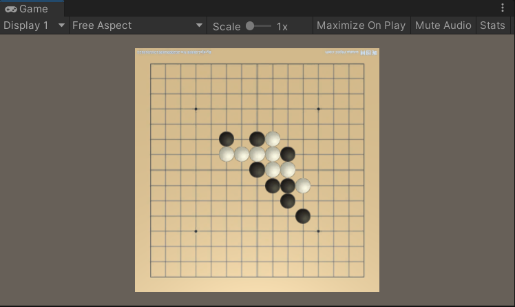
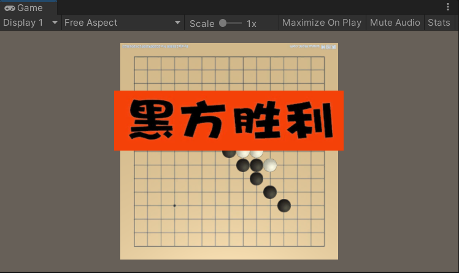

## 五子棋
##### ——————————————————

##### 参考文章
https://www.jb51.net/article/170140.htm （更改了判断赢棋的函数）
https://blog.csdn.net/weixin_33985453/article/details/117209273
https://blog.csdn.net/weixin_36076701/article/details/117207906

##### 游戏流程

函数Start()中，指定黑棋为先手，chessPos存储棋盘上可以落子的位置, chessState存储棋盘上位置的落子形态。

函数Update()中，首先使用WorldToScreenPoint()将点从世界空间变换到屏幕空间，计算出棋盘四角的锚点在屏幕上的映射位置。然后使用锚点位置和棋盘格子数算出格子的宽高。
计算出可以落子的点的位置，存储在chessPos里面。
然后确定鼠标的点击位置，离点击最近的位置若为空则落子，根据下棋顺序确定落子的颜色，落子成功后更换下棋方。
判断函数确认是否有获胜方。
按下空格（不论是否有获胜方）重新开始游戏。

##### 关键函数
1. 计算平面距离的函数
2. OnGUI
   根据棋盘状态，绘制黑白棋子
   根据获胜状态，绘制胜利图片
3. 判断输赢的函数
   不是扫描整个棋盘，而是根据最近落点的位置进行4个方向上的判断。首先记录下落子的坐标，然后通过对坐标的加减获得各个方向的坐标，查询state,进而判断是否赢。再通过当前下棋方判断赢的是谁。

##### 运行效果

