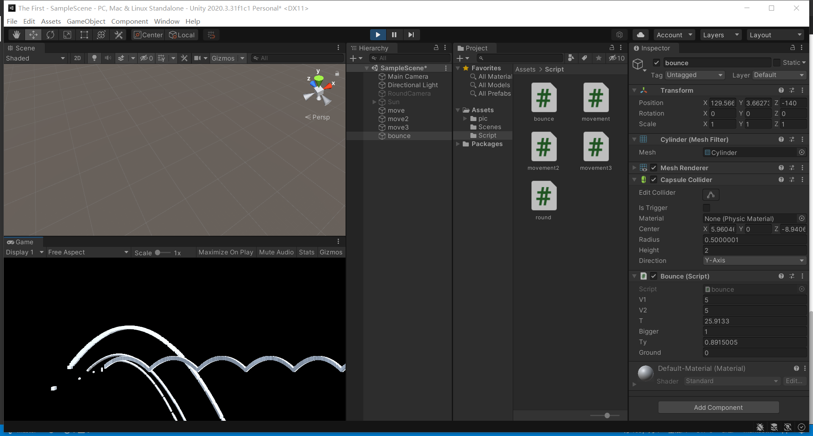
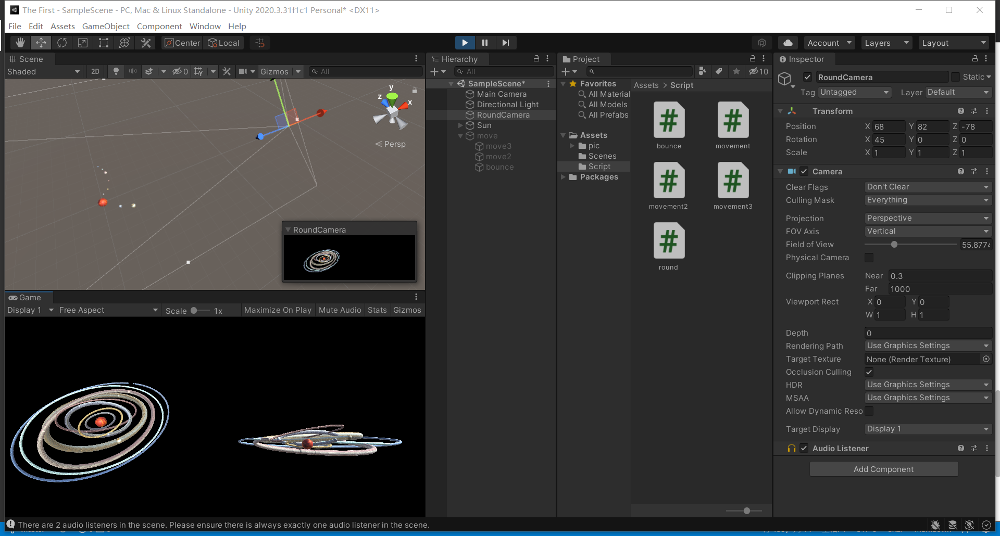

# 作业三

## 抛物线
### 实现斜抛抛物线
1.总时间每帧递加，根据运动公式，直接修改transform.position的位置。
```C#
// 1   
// 直接修改transform.position的位置
public class movement : MonoBehaviour
{   // 初速度
    public float v1 = 10f;// speed x
    public float v2 = 5f;// speed y
    public float t = 0;  // total time
    public float bigger = 5;// 放大坐标，更易看
    void Start()
    {
        t = 0;
    }
    void Update()
    {   // 抛物线移动 x = v1t y = v2t - 5 * t^2
        t += Time.deltaTime ;
        Vector3 position = transform.position;
        position.x = bigger * (v1 * t);
        position.y = bigger * (v2 * t -  5 * t * t);
        transform.position = position;
    }
}
```
2.不计算总时间，令y轴速度根据加速度递增（减），对xy坐标进行每帧增加改变量
```C#
// 2   
// 令y轴速度根据加速度递增（减）。
public class movement2 : MonoBehaviour
{   // 初速度
    public float v1 = 10f;// speed x
    public float v2 = 100f;// speed y
    public float a = 1;// 加速度
    public float bigger = 1;// 放大坐标，更易看
    ...
    // Update is called once per frame
    void Update()
    {   // 抛物线移动 x = v1t y = v2t - 5 * t^2
        Vector3 position = transform.position;

        position.x += bigger * (Time.deltaTime*v1);  // 匀直
        position.y += bigger * (Time.deltaTime*(v2/10));

        transform.position = position;
        v2 -= a;   // 有加速度
    }
}
```
3.使用Vector3向量的方式，将XY的增量设置为一个向量，对坐标进行向量的加法。
直接相加或者使用Translate()方法。
```C#
// 使用Vector3
public class movement3 : MonoBehaviour
{
    public float v1 = 10f;// speed x
    public float v2 = 100f;// speed y
    public float a = 1;// 加速度
    // public float bigger = 1;// 放大坐标，更易看
    void Start()
    {
        
    }

    void Update()
    {   // 抛物线移动 x = v1t y = v2t - 5 * t^2
        Vector3 change = new Vector3(Time.deltaTime*v1,Time.deltaTime*(v2/10),0);
        transform.position += change;
        // transform.Translate(change);
        v2 -= a;   // 有加速度
    }
}
```
### 反弹
分开计算X，Y轴时间，当Y坐标触地时重置Y时间
```C#
    public float v1 = 5f;// speed
    public float v2 = 5f;// speed
    public float t = 0;
    public float bigger = 5;
    public float ty = 0;
    public float ground = 0;
    void Start()
    {
        t = 0;
        ty = 0; // 初始化总时间
    }

    void Update()
    {   // 抛物线移动 x = v1t y = v2t - 5 * t^2
        t += Time.deltaTime ;
        ty += Time.deltaTime;
        
        Vector3 position = transform.position;
        position.x = bigger*(v1 * t);
        position.y = bigger*(v2 * ty -  ty * ty);

        if(position.y<=ground){
            ty = 0;
        }
        transform.position = position;
    }
```
### 运行截图



## 太阳系模型
### 代码
round.cs 用于物体围绕原点做圆周运动，可以自行设定旋转轴，速度。
通过为每个星球设定不同的旋转轴和旋转速度，实现任务目的。
```C#
public class round : MonoBehaviour
{   // 设定旋转轴
    public float x;
    public float y;
    public float z;

    public float anglepersec; // 设定每秒旋转的角度

    // 通过设定不同的旋转轴和角速度，为每个星球设定不同的法平面和旋转速度

    Vector3 CenterPosition = Vector3.zero; //圆心的位置，设定在（0，0）点
    Vector3 r; //圆半径，也就是要旋转的向量。

    Vector3 thecenter;

    // Start is called before the first frame update
    void Start()
    {
        r = transform.position - CenterPosition; //圆心指向“我”的向量，就是半径
        thecenter.x = x;
        thecenter.y = y;
        thecenter.z = z;
    }

    // Update is called once per frame
    void Update()
    {   
        // this.transform.RotateAround(targetTrans.position, Vector3.forward, 180 * Time.deltaTime);
        //以每秒180度的速度旋转“半径”向量，旋转轴是Z轴。
        // r = Quaternion.AngleAxis(180 * Time.deltaTime, Vector3.up) * r;
        r = Quaternion.AngleAxis(anglepersec * Time.deltaTime, thecenter) * r;
        //圆心位置 + 半径 = 圆上的点
        transform.position = CenterPosition + r;
    }
}
```
### 运行截图
使用maincamera+RoundCamera进行多角度查看
