## 作业4-绘制地形

### 创建地形
game object->3d object->terrain 

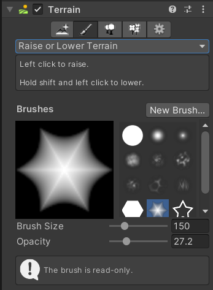

在Terrain对象的Terrain组件中，选取不同的绘制地形工具（创建相邻地形、绘制地形、绘制树、绘制细节、地形设置）以绘制地形。
首先选第二个绘制地形，Raise or Lower Terrain可以使用不同的笔刷，以不同的形状和力度升高降低地形，set height则设定了最高的高度，可以绘制出高原的效果；paint texture可以为地形绘制材质，进行贴图。

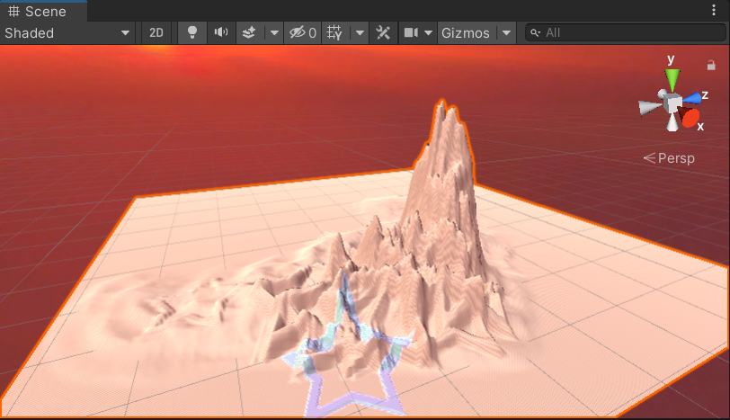

### 地形表面
使用paint tree paint detail可以在地形上绘制树以及小草。
首先在资源商店里面搜索地形资源。这里下载了Terrain Tools，导入到自己的项目中。
此时可以为自己的地形添加预设好的树木模型
Paint tree->edit tree->add tree选择添加资源中的多种树木：
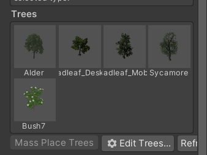

点击Mass Place Tree,选择数量，即可大量放置不同种的树木。
接着添加小草，Paint Detail, 选择小草的材质，使用不同的笔刷形状绘制，如下：

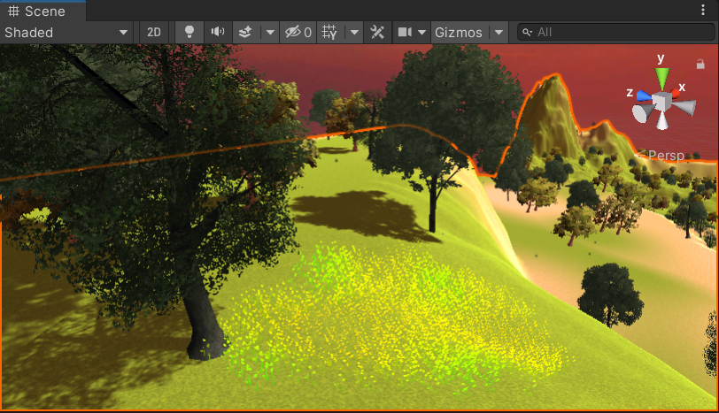
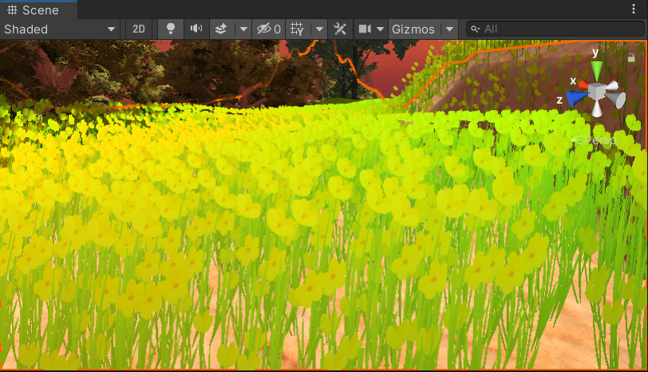

最终效果：

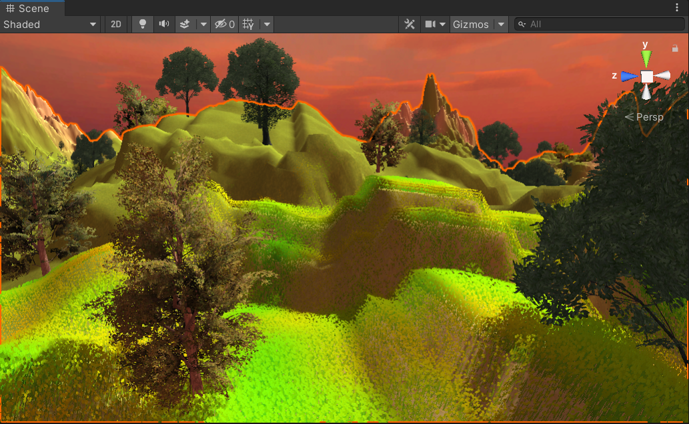
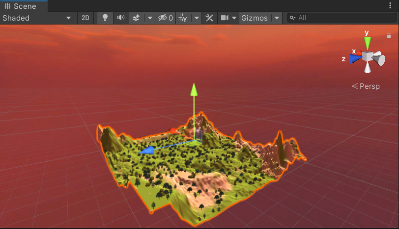

### 天空

下载Fantasy Skybox FREE 
选择天空样式。不同的天空在地形上会反映出不同的光线效果：

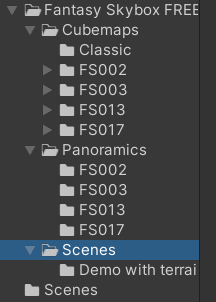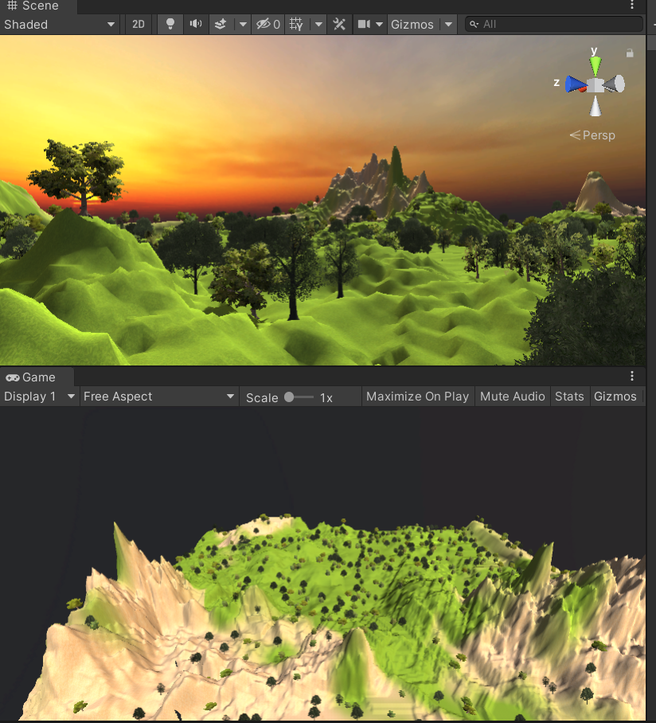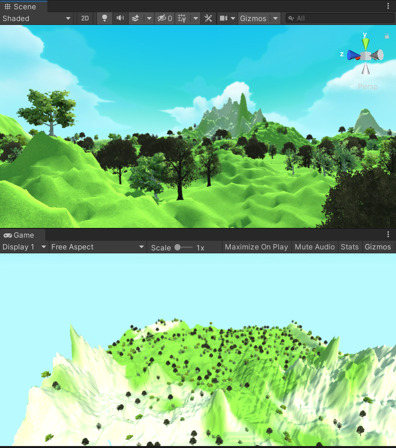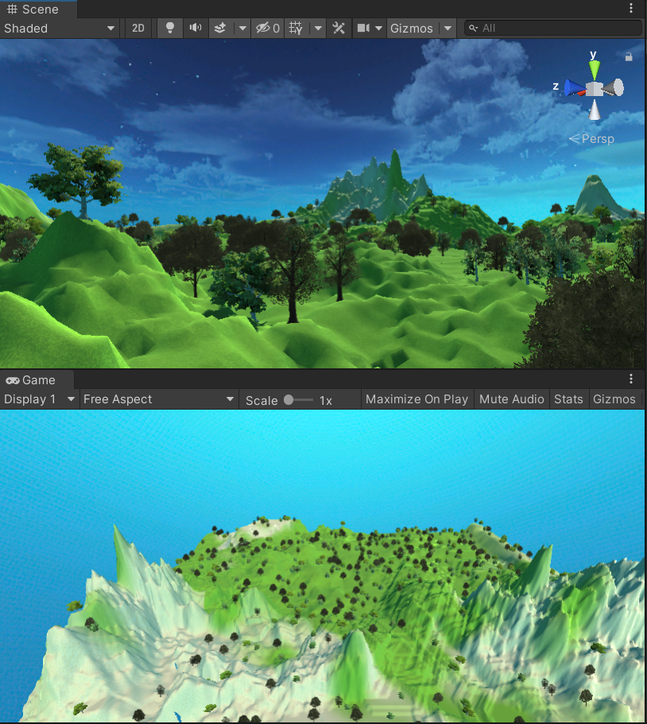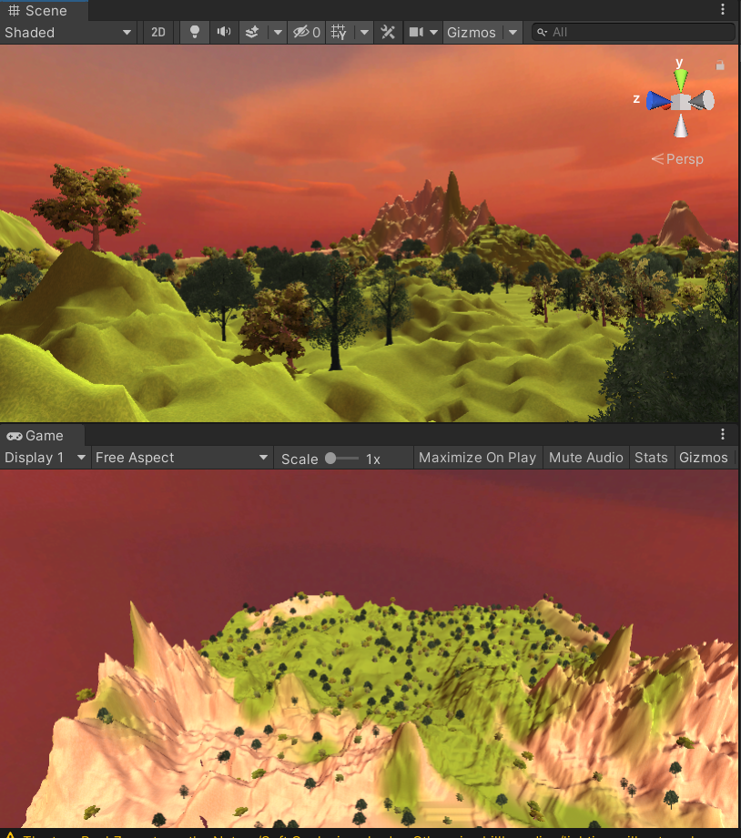