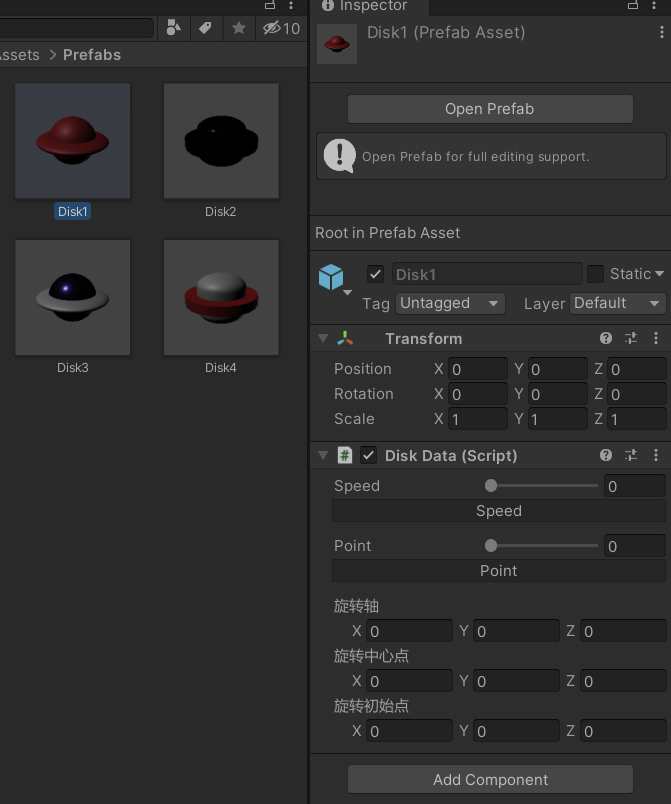

## 作业5-用自定义组件定义几种飞碟，做成预制


### 预制体
1. 在Assets文件夹下新建Prefabs文件夹

在文件夹内右键->create->prefabs,新建预制体。


2. 双击预制体，进行飞碟的设计
在预制体中添加所需的gameobject，并进行设计


3. 颜色设计

在Materials文件夹中可以新建materials，调整属性以赋予材质不同的外观


预制体：


预制体添加到游戏场景中：


### 设定飞碟属性
和之前做过的物体指定旋转轴旋转结合，让飞碟可以绕某个轴旋转，拥有分数。

使用Editor自定义编辑窗口，添加速度（每秒的角度）和分数的滑动条，添加旋转轴，旋转中心，初始位置的向量文本输入框。

参考：
https://blog.csdn.net/qq_57896821/article/details/121264618
https://docs.unity3d.com/ScriptReference/Editor.html

```C#
[CustomEditor (typeof(DiskData))]
public class DiskDataEditor : Editor
{

    public override void OnInspectorGUI()
    {
        DiskData d = (DiskData)target;

        d.speed = EditorGUILayout.IntSlider ("Speed", d.speed, 0, 360);
        ProgressBar (d.speed / 360.0f, "Speed");

        d.point= EditorGUILayout.IntSlider ("Point", d.point, 0, 10);
        ProgressBar (d.point / 10.0f, "Point");

        d.direction= EditorGUILayout.Vector3Field("旋转轴",d.direction);

        d.CenterPosition = EditorGUILayout.Vector3Field("旋转中心点",d.CenterPosition);

        d.transform.position = EditorGUILayout.Vector3Field("旋转初始点",d.transform.position);

    }

    // Custom GUILayout progress bar.
    void ProgressBar (float value, string label)
    {
        // Get a rect for the progress bar using the same margins as a textfield:
        Rect rect = GUILayoutUtility.GetRect (18, 18, "TextField");
        EditorGUI.ProgressBar (rect, value, label);
        EditorGUILayout.Space ();
    }
}
```
布局效果：


点击运行，飞碟会以设定的参数旋转飞行。飞行的时候滑动speed,飞碟的速度会改变

### 添加至预制体
在预制体中点击AddComponent->Scripts->DiskData



### 运行

