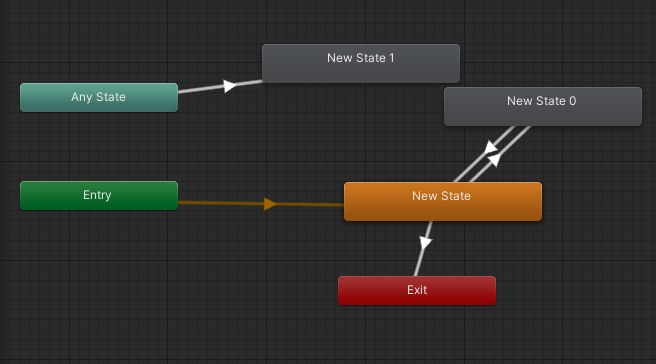

# 智能巡逻兵
【20337060李思莹】
【题目】
 游戏设计要求：
• 创建一个地图和若干巡逻兵(使用动画)；
• 每个巡逻兵走一个3~5个边的凸多边型，位置数据是相对地址。即每次
确定下一个目标位置，用自己当前位置为原点计算；
• 巡逻兵碰撞到障碍物，则会自动选下一个点为目标；
• 巡逻兵在设定范围内感知到玩家，会自动追击玩家；
• 失去玩家目标后，继续巡逻；
• 计分：玩家每次甩掉一个巡逻兵计一分，与巡逻兵碰撞游戏结束；
 程序设计要求：
• 必须使用订阅与发布模式传消息
• 工厂模式生产巡逻兵
 提示1：生成 3~5个边的凸多边型
• 随机生成矩形
• 在矩形每个边上随机找点，可得到 3 - 4 的凸多边型

# 模型和动画
下载相关模型和动画，以构建巡逻兵、玩家和场景。（如toonytinypeople）
人物模型（带动画资源）。

新建animationcontroller文件夹，新建Patrol Controller和Player Controller两个动画控制器。设置动画，巡逻兵在任何状态可以进入射击状态，玩家则在在任何状态可以进入死亡状态；一开始进入idle状态，游戏过程中可以进入run状态进行奔跑，并可以切换。


巡逻兵和玩家都需要添加rigidBody和CapsuleCollider两个部件，capsule需要调整碰撞检测的大小。巡逻兵和玩家碰撞后巡逻兵进行'shoot',玩家进行'death',相应动画进行。
场地预设：

需要检测每个格子中的碰撞，每个格子里面有一个trigger，BoxCollider用于检测玩家是否进入该区域。AreaCollide脚本标记玩家进入的区域。


## 玩家
## UserGUI
玩家使用方向键控制人物行动，展示分数，控制游戏重新开始按钮。
```C#
void Update()
    {
        if (Input.GetKey(KeyCode.UpArrow)) {
            action.MovePlayer(Diretion.UP);
        }
        if (Input.GetKey(KeyCode.DownArrow)) {
            action.MovePlayer(Diretion.DOWN);
        }
        if (Input.GetKey(KeyCode.LeftArrow)) {
            action.MovePlayer(Diretion.LEFT);
        }
        if (Input.GetKey(KeyCode.RightArrow)) {
            action.MovePlayer(Diretion.RIGHT);
        }
    }
```
## 碰撞
## PlayerCollide
当玩家与侦察兵相撞，触发玩家的death变量，使玩家倒地，触发巡逻兵的shoot变量，使巡逻兵发动攻击，调用PlayerGameover表示游戏结束。
```C#
void OnCollisionEnter(Collision other)
{
    //当玩家与侦察兵相撞
    if (other.gameObject.tag == "Player")
    {
        //触发玩家的death变量，使玩家倒地
        other.gameObject.GetComponent<Animator>().SetTrigger("death");
        //触发巡逻兵的shoot变量,使巡逻兵发动攻击
        this.GetComponent<Animator>().SetTrigger("shoot");
        //游戏结束
        Singleton<GameEventManager>.Instance.PlayerGameover();
    }
}
```
## PatrolCollide
当玩家进入侦察兵追捕范围，启动追捕模式，并将追捕对象设置为玩家，开始追捕
玩家跑出侦察兵追捕范围，关闭追捕模式，将追捕对象设置为空，结束追捕
```C#
void OnTriggerEnter(Collider collider)
{
    //玩家进入侦察兵追捕范围，开始追捕
    if (collider.gameObject.tag == "Player")
    {
        //启动追捕模式
        this.gameObject.transform.parent.GetComponent<PatrolData>().follow_player = true;
        //将追捕对象设置为玩家
        this.gameObject.transform.parent.GetComponent<PatrolData>().player = collider.gameObject;
    }
}
void OnTriggerExit(Collider collider)
{
    //玩家跑出侦察兵追捕范围，结束追捕
    if (collider.gameObject.tag == "Player")
    {
        //关闭追捕模式
        this.gameObject.transform.parent.GetComponent<PatrolData>().follow_player = false;
        //将追捕对象设置为空
        this.gameObject.transform.parent.GetComponent<PatrolData>().player = null;
    }
}

```
## AreaCollide
当玩家进入该区域的时候，通过调用sceneController.wall_sign = sign;设置场景控制器的区域标识为自己的标识，这样巡逻兵就知道玩家现在在哪个区域了
```C#
private void Start()
{
    sceneController = SSDirector.GetInstance().CurrentScenceController as FirstSceneController;
}
void OnTriggerEnter(Collider collider)
{
    //标记玩家进入自己的区域
    if (collider.gameObject.tag == "Player")
    {
        sceneController.wall_sign = sign;
    }
}
```
## 工厂模式
## PropFactory
生成巡逻兵
```C#
public List<GameObject> GetPatrols()
{
    int[] pos_x = { -6, 4, 13 };
    int[] pos_z = { -4, 6, -13 };
    int index = 0;
    //生成不同的巡逻兵初始位置
    for(int i=0;i < 3;i++)
    {
        for(int j=0;j < 3;j++)
        {
            vec[index] = new Vector3(pos_x[i], 0, pos_z[j]);
            index++;
        }
    }
    for(int i=0; i < 9; i++)
    {
        patrol = Instantiate(Resources.Load<GameObject>("Prefabs/Patrol"));
        patrol.transform.position = vec[i];
        patrol.GetComponent<PatrolData>().sign = i + 1;
        patrol.GetComponent<PatrolData>().start_position = vec[i];
        used.Add(patrol);
    }   
    return used;
}
```
## PatrolData
```C#
public int sign;                      //标志巡逻兵在哪一块区域
public bool follow_player = false;    //是否跟随玩家
public int wall_sign = -1;            //当前玩家所在区域标志
public GameObject player;             //玩家游戏对象
public Vector3 start_position;        //当前巡逻兵初始位置  
```


## 订阅与发布模式
在订阅与发布模式中订阅者没必要知道和功能调用有关的类，只需要知道发布者即可；
而发布者调用对应的方法来进行实际操作，使用这种模式来降低代码的耦合度。

在该程序中，GameEventManager作为发布者，FirstSceneController作为订阅者。
## GameEvenManager
```C#
//玩家逃脱
public void PlayerEscape()
{
    if (ScoreChange != null)
    {
        ScoreChange();
    }
}
//玩家被捕
public void PlayerGameover()
{
    if (GameoverChange != null)
    {
        GameoverChange();
    }
}
```
## FirstSceneController
作为订阅者，订阅了GameEventManager中的事件，因此只要相应事件发生，就会导致场景控制器调用注册的方法。
```C#
void OnEnable()
{   //注册事件
    GameEventManager.ScoreChange += AddScore;
    GameEventManager.GameoverChange += Gameover;
    
}
void OnDisable()
{   //取消注册事件
    GameEventManager.ScoreChange -= AddScore;
    GameEventManager.GameoverChange -= Gameover;
    
}

void AddScore()
{
    recorder.AddScore();
}
void Gameover()
{
    game_over = true;
    patrol_factory.StopPatrol();
    action_manager.DestroyAllAction();
}
```

## 动作管理模块

## SSActionManager
控制巡逻兵的动作，使用列表管理巡逻兵追踪或者巡逻
```C#

public class SSActionManager : MonoBehaviour, ISSActionCallback
{
    private Dictionary<int, SSAction> actions = new Dictionary<int, SSAction>();    //将执行的动作的字典集合
    private List<SSAction> waitingAdd = new List<SSAction>();                       //等待去执行的动作列表
    private List<int> waitingDelete = new List<int>();                              //等待删除的动作的key                

    protected void Update()
    {
        foreach (SSAction ac in waitingAdd)
        {
            actions[ac.GetInstanceID()] = ac;
        }
        waitingAdd.Clear();

        foreach (KeyValuePair<int, SSAction> kv in actions)
        {
            SSAction ac = kv.Value;
            if (ac.destroy)
            {
                waitingDelete.Add(ac.GetInstanceID());
            }
            else if (ac.enable)
            {
                //运动学运动更新
                ac.Update();
            }
        }

        foreach (int key in waitingDelete)
        {
            SSAction ac = actions[key];
            actions.Remove(key);
            DestroyObject(ac);
        }
        waitingDelete.Clear();
    }
 
    public void RunAction(GameObject gameobject, SSAction action, ISSActionCallback manager)
    {
        action.gameobject = gameobject;
        action.transform = gameobject.transform;
        action.callback = manager;
        waitingAdd.Add(action);
        action.Start();
    }

    public void SSActionEvent(SSAction source, int intParam = 0, GameObject objectParam = null)
    {
        if(intParam == 0)
        {
            //侦查兵跟随玩家
            PatrolFollowAction follow = PatrolFollowAction.GetSSAction(objectParam.gameObject.GetComponent<PatrolData>().player);
            this.RunAction(objectParam, follow, this);
        }
        else
        {
            //侦察兵按照初始位置开始继续巡逻
            GoPatrolAction move = GoPatrolAction.GetSSAction(objectParam.gameObject.GetComponent<PatrolData>().start_position);
            this.RunAction(objectParam, move, this);
            //玩家逃脱
            Singleton<GameEventManager>.Instance.PlayerEscape();
        }
    }


    public void DestroyAll()
    {
        foreach (KeyValuePair<int, SSAction> kv in actions)
        {
            SSAction ac = kv.Value;
            ac.destroy = true;
        }
    }
}

```

## PatrolActionManager
场景控制器调用PatrolActionManager中的方法，让巡逻兵开始巡逻，当游戏结束的时候，调用方法让巡逻兵停止巡逻
```C#
public class PatrolActionManager : SSActionManager
{
    private GoPatrolAction go_patrol;                            //巡逻兵巡逻

    public void GoPatrol(GameObject patrol)
    {
        go_patrol = GoPatrolAction.GetSSAction(patrol.transform.position);
        this.RunAction(patrol, go_patrol, this);
    }
    //停止所有动作
    public void DestroyAllAction()
    {
        DestroyAll();
    }
}

```
## PatrolFollowAction
巡逻兵追逐玩家，当玩家离开了巡逻兵触发器的范围或是玩家已经不在该区域内了，巡逻兵停止追逐
```C#
    public override void Update()
    {
        if (transform.localEulerAngles.x != 0 || transform.localEulerAngles.z != 0)
        {
            transform.localEulerAngles = new Vector3(0, transform.localEulerAngles.y, 0);
        }
        if (transform.position.y != 0)
        {
            transform.position = new Vector3(transform.position.x, 0, transform.position.z);
        }
         
        Follow();
        //如果侦察兵没有跟随对象，或者需要跟随的玩家不在侦查兵的区域内
        if (!data.follow_player || data.wall_sign != data.sign)
        {
            this.destroy = true;
            this.callback.SSActionEvent(this,1,this.gameobject);
        }
    }
    public override void Start()
    {
        data = this.gameobject.GetComponent<PatrolData>();
    }
    void Follow()
    {
        transform.position = Vector3.MoveTowards(this.transform.position, player.transform.position, speed * Time.deltaTime);
        this.transform.LookAt(player.transform.position);
    }
```
##  GoPatrolAction
```C#

public class GoPatrolAction : SSAction
{
    private enum Dirction { EAST, NORTH, WEST, SOUTH };
    private float pos_x, pos_z;                 //移动前的初始x和z方向坐标
    private float move_length;                  //移动的长度
    private float move_speed = 1.2f;            //移动速度
    private bool move_sign = true;              //是否到达目的地
    private Dirction dirction = Dirction.EAST;  //移动的方向
    private PatrolData data;                    //侦察兵的数据
    

    private GoPatrolAction() { }
    public static GoPatrolAction GetSSAction(Vector3 location)
    {
        GoPatrolAction action = CreateInstance<GoPatrolAction>();
        action.pos_x = location.x;
        action.pos_z = location.z;
        //设定移动矩形的边长
        action.move_length = Random.Range(4, 7);
        return action;
    }
    public override void Update()
    {
        //防止碰撞发生后的旋转
        if (transform.localEulerAngles.x != 0 || transform.localEulerAngles.z != 0)
        {
            transform.localEulerAngles = new Vector3(0, transform.localEulerAngles.y, 0);
        }            
        if (transform.position.y != 0)
        {
            transform.position = new Vector3(transform.position.x, 0, transform.position.z);
        }
        //侦察移动
        Gopatrol();
        //如果侦察兵需要跟随玩家并且玩家就在侦察兵所在的区域，侦查动作结束
        if (data.follow_player && data.wall_sign == data.sign)
        {
            this.destroy = true;
            this.callback.SSActionEvent(this,0,this.gameobject);
        }
    }
    public override void Start()
    {
        this.gameobject.GetComponent<Animator>().SetBool("run", true);
        data  = this.gameobject.GetComponent<PatrolData>();
    }

    void Gopatrol()
    {
        if (move_sign)
        {
            //不需要转向则设定一个目的地，按照矩形移动
            switch (dirction)
            {
                case Dirction.EAST:
                    pos_x -= move_length;
                    break;
                case Dirction.NORTH:
                    pos_z += move_length;
                    break;
                case Dirction.WEST:
                    pos_x += move_length;
                    break;
                case Dirction.SOUTH:
                    pos_z -= move_length;
                    break;
            }
            move_sign = false;
        }
        this.transform.LookAt(new Vector3(pos_x, 0, pos_z));
        float distance = Vector3.Distance(transform.position, new Vector3(pos_x, 0, pos_z));
        //当前位置与目的地距离浮点数的比较
        if (distance > 0.9)
        {
            transform.position = Vector3.MoveTowards(this.transform.position, new Vector3(pos_x, 0, pos_z), move_speed * Time.deltaTime);
        }
        else
        {
            dirction = dirction + 1;
            if(dirction > Dirction.SOUTH)
            {
                dirction = Dirction.EAST;
            }
            move_sign = true;
        }
    }
}

```
## 主控制模块
包括IUserAction, SSDirector, ISceneController, FristSceneController
## FristSceneController
```C#
public PropFactory patrol_factory;                               //巡逻者工厂
    public ScoreRecorder recorder;                                   //记录员
    public PatrolActionManager action_manager;                       //运动管理器
    public int wall_sign = -1;                                       //当前玩家所处哪个格子
    public GameObject player;                                        //玩家
    public Camera main_camera;                                       //主相机
    public float player_speed = 5;                                   //玩家移动速度
    public float rotate_speed = 135f;                                //玩家旋转速度
    private List<GameObject> patrols;                                //场景中巡逻者列表
                              //场景水晶列表
    private bool game_over = false;                                  //游戏结束
public class Diretion {
        public const int UP = 0;
        public const int DOWN = 2;
        public const int LEFT = -1;
        public const int RIGHT =1;
    }
    void Update()
    {
        for (int i = 0; i < patrols.Count; i++)
        {
            patrols[i].gameObject.GetComponent<PatrolData>().wall_sign = wall_sign;
        }
        
    }
    void Start()
    {
        SSDirector director = SSDirector.GetInstance();
        director.CurrentScenceController = this;
        patrol_factory = Singleton<PropFactory>.Instance;
        action_manager = gameObject.AddComponent<PatrolActionManager>() as PatrolActionManager;
        LoadResources();
        main_camera.GetComponent<CameraFlow>().follow = player;
        recorder = Singleton<ScoreRecorder>.Instance;
    }

    public void LoadResources()
    {
        Instantiate(Resources.Load<GameObject>("Prefabs/Plane"));
        player = Instantiate(Resources.Load("Prefabs/Player"), new Vector3(0, 9, 0), Quaternion.identity) as GameObject;
        
        patrols = patrol_factory.GetPatrols();
        //所有侦察兵移动
        for (int i = 0; i < patrols.Count; i++)
        {
            action_manager.GoPatrol(patrols[i]);
        }
    }
    //玩家移动
    public void MovePlayer(int dir)
    {
        if(!game_over)
        {
            if (dir == 0 || dir == 1 || dir == -1 || dir == 2)
            {
                player.GetComponent<Animator>().SetBool("run", true);
            }
            else
            {
                player.GetComponent<Animator>().SetBool("run", false);
            }
            //移动和旋转
            //player.transform.Translate(0, 0, translationZ * player_speed * Time.deltaTime);
            //player.transform.Rotate(0, translationX * rotate_speed * Time.deltaTime, 0);
            player.transform.rotation = Quaternion.Euler(new Vector3(0, dir * 90, 0));
        switch (dir) {
            case Diretion.UP:
                player.transform.position += new Vector3(0, 0, 0.1f);
                break;
            case Diretion.DOWN:
                player.transform.position += new Vector3(0, 0, -0.1f);
                break;
            case Diretion.LEFT:
                player.transform.position += new Vector3(-0.1f, 0, 0);
                break;
            case Diretion.RIGHT:
                player.transform.position += new Vector3(0.1f, 0, 0);
                break;
        }
            //防止碰撞带来的移动
            if (player.transform.localEulerAngles.x != 0 || player.transform.localEulerAngles.z != 0)
            {
                player.transform.localEulerAngles = new Vector3(0, player.transform.localEulerAngles.y, 0);
            }
            if (player.transform.position.y != 0)
            {
                player.transform.position = new Vector3(player.transform.position.x, 0, player.transform.position.z);
            }     
        }
    }

    public int GetScore()
    {
        return recorder.GetScore();
    }

    
    public bool GetGameover()
    {
        return game_over;
    }
    public void Restart()
    {
        SceneManager.LoadScene("Scenes/mySence");
    }
```

