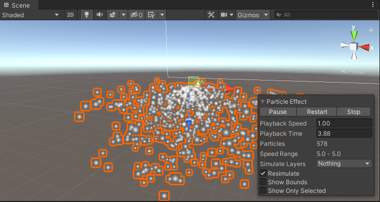

# 作业7 简单粒子制作
【20337060 李思莹】
效果：点击Change Scene 变换场景，2个场景的粒子系统效果不一样。粒子系统根据场景的名称判断不同场景，改变其不同属性。
## 场景变换
### 1.创建场景
右键Assets->Create->Scene, 创建新的场景Scene2, 并且给原先的场景改名为Scene1

### 2.添加按钮
在Scene1中添加UI->Button,拉到合适位置。

### 3.场景切换的脚本
```c#
using System.Collections;
using System.Collections.Generic;
using UnityEngine;
using UnityEngine.UI;
using UnityEngine.SceneManagement;

public class Start_Scene : MonoBehaviour
{
    // Start is called before the first frame update
    void Start()
    {   // 构造按钮
        Button btn = transform.GetComponent<Button>();
        btn.onClick.AddListener(eventListener);
    }

    // Update is called once per frame
    void Update() {}
    // 监听按钮，点击按钮触发‘加载场景’事件
    void eventListener(){
        SceneManager.LoadScene("Scene2");
    }
}

```


## 简单粒子
### 1.在场景中放置粒子
点击Effects->Particle System,放到2个场景中


### 2.粒子脚本
```cs
using System.Collections;
using System.Collections.Generic;
using UnityEngine;
using UnityEngine.SceneManagement;

public class ParticleinS : MonoBehaviour
{   

    ParticleSystem part;
    ParticleSystem.ShapeModule parShape;
    // Start is called before the first frame update
    void Start()
    {
        part = GetComponent<ParticleSystem>();
        parShape = part.shape;
        // 根据场景不同的不同效果
        if (SceneManager.GetActiveScene ().name == "Scene1" ){
            parShape.shapeType = ParticleSystemShapeType.Hemisphere;
        }
        else{
            parShape.shapeType = ParticleSystemShapeType.Sphere;
        }
    }

    // Update is called once per frame
    void Update()
    {

    }
}

```
## 运行效果

点击按钮：
