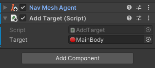
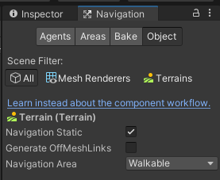
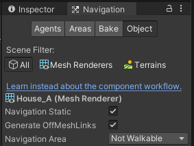
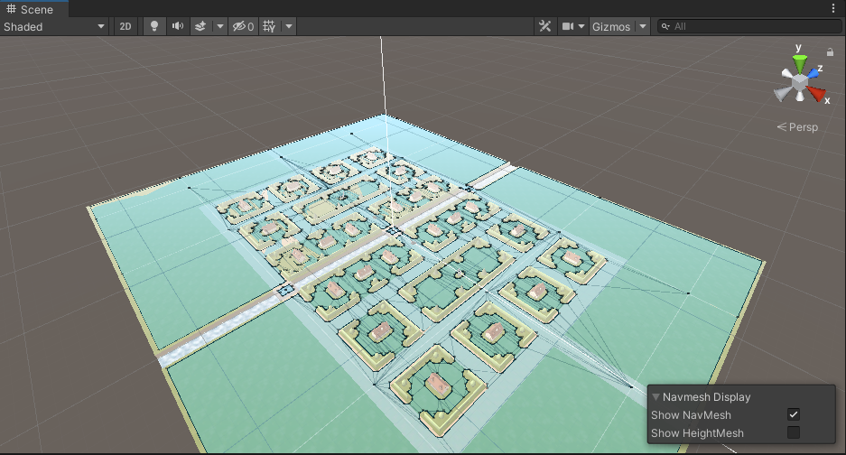
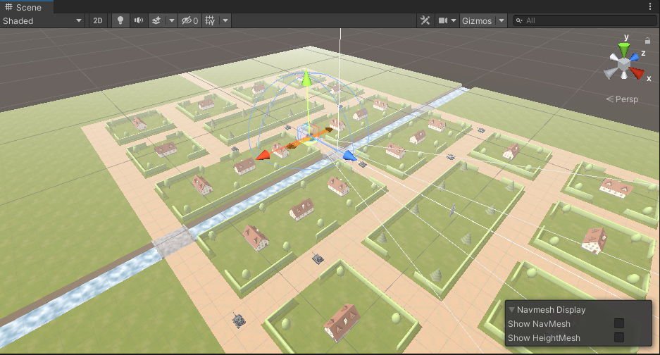
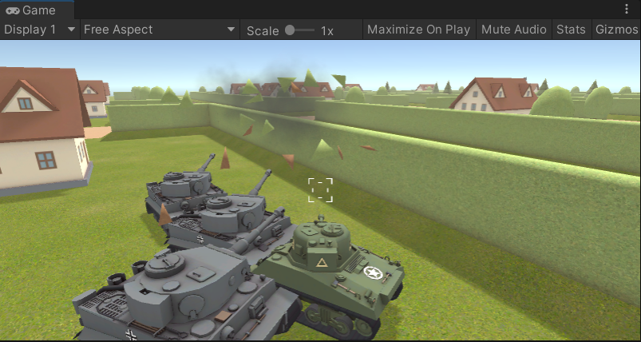

# 作业8 坦克AI
【20337060 李思莹】
【题目】
坦克对战游戏 AI设计
从商店下载游戏：“ Kawaii” Tank 或 其他坦克模型，构建 AI 对战坦克。具
体要求：
✓ 使用“感知-思考-行为”模型，建模 AI 坦克
✓ 场景中要放置一些障碍阻挡对手视线
✓ 坦克要放置一个矩阵包围盒触发器，保证 AI 坦克能使用射线探测对手方位
✓ AI 坦克必须在有目标条件下使用导航，并能绕过障碍。
✓ 实现人机对战


### 场景下载
从商店下载游戏“ Kawaii” Tank ，打开town场景，为对方坦克（AI坦克）添加组件NavMeshAgent;
## AI 坦克
### 前进目标
```c#
using System.Collections;
using System.Collections.Generic;
using UnityEngine;
using UnityEngine.AI;

public class AddTarget : MonoBehaviour
{
    public GameObject target;
    NavMeshAgent mr;
    // Start is called before the first frame update
    void Start()
    {
        mr = GetComponent<NavMeshAgent>();
    }

    // Update is called once per frame
    void Update()
    {
        mr.SetDestination(target.transform.position);
    }
}

```
设置玩家所操纵的坦克为target。

### 开火控制
修改Fire_Control_CS.cs的代码，令AI坦克也可开枪
```c#
if (isSelected)
{
    inputScript.Get_Input();
}
else{
    Fire ();
}
```
### 消失控制
修改Damage_Control_CS.cs,添加this.gameObject.SetActive(false);令AI坦克在损坏时消失。
```C#
void Destroyed_Linkage()
    {   
        // Spawn the destroyed effects.
        if (destroyedPrefab)
        {
            Instantiate(destroyedPrefab, bodyTransform.position, Quaternion.identity, bodyTransform);
        }

        // Remove the damage text.
        if (displayScript)
        {
            Destroy(displayScript.gameObject);
        }

        // Remove the dying effect.
        if (dyingObject)
        {
            Destroy(dyingObject);
        }

        // Remove this script.
        Destroy(this);
        
        if(!isSelected){// AI dead
            this.gameObject.SetActive(false);
        }
        else{// playerdead
            
        }
    }
```

### 剩余敌人数目展示
添加UI——Text,挂载以下脚本，设置敌对坦克的tag为enemy，以统计当前在场的敌人数目。
```C#
public class score_text : MonoBehaviour
{   public int Enemynumber = 0 ;
    private GameObject[] gos;
    private Text m_Text;
    // Start is called before the first frame update
    void Start()
    {
        m_Text = GetComponent<Text>();
    }

    // Update is called once per frame
    void Update()
    {
        gos = GameObject.FindGameObjectsWithTag("Enemy");
        Enemynumber = gos.Length;
        if(Enemynumber!=0){
            m_Text.text = Enemynumber.ToString();
        }
        else
        {
            m_Text.text = "0, 已胜利！";
        }
    }
}

```
效果：


## 设置地图
设置terrain为可走

设置房子为不可走

点击bake生成Navmesh

布置场景，在town中增加更多的对方坦克：



## 运行效果
